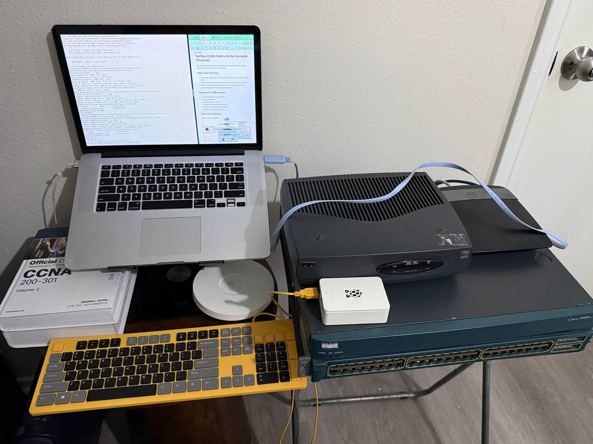
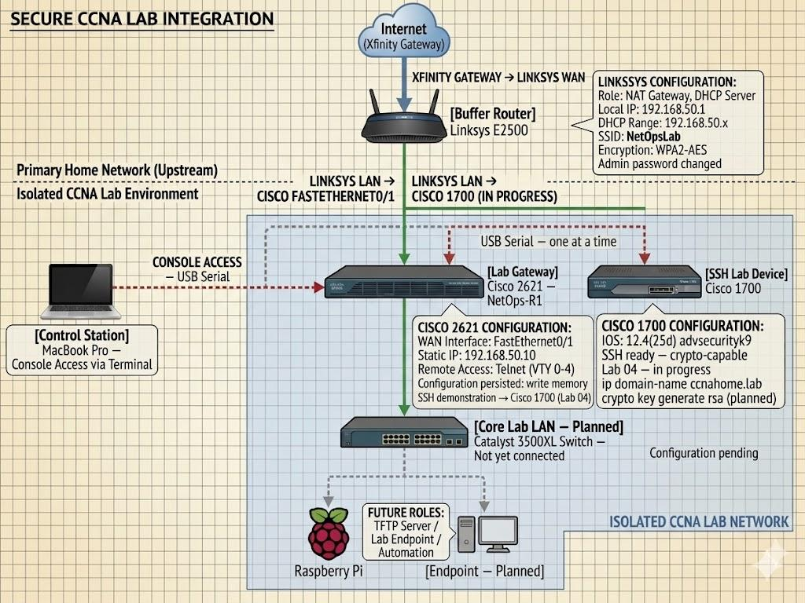

# NetOps CCNA Safety Buffer Homelab (Physical)

**Goal:** Isolated physical CCNA lab environment with internet access — primary home network fully protected.



---

## Overview

A physical Cisco homelab built for CCNA 200-301 preparation and portfolio development. Every configuration is real — no simulations, no GNS3, no Packet Tracer. The lab environment isolates Cisco equipment behind a Linksys E2500 buffer router to prevent experimental configurations from affecting the upstream home network.

The lab has evolved from a flat single-router setup to a full switched VLAN topology with inter-VLAN routing. The Catalyst 3500XL is now active as the core lab switch, segmenting the network into isolated broadcast domains. A parallel Wireshark traffic analysis series documents every protocol interaction with live packet captures.

---

## Equipment & Technologies

| Device | Role | Status |
|---|---|---|
| Cisco 2621 — NetOps-R1 | Inter-VLAN router — IOS 12.1(3)T | ✅ Active |
| Cisco 1700 — NetOps-1700 | SSH lab device — IOS 12.4(25d) advsecurityk9 | ✅ Active |
| Catalyst 3500XL — NetOps-SW1 | Core lab switch — IOS 12.0(5)WC3b | ✅ Active |
| Linksys E2500 — NetOpsZero | Safety buffer router — NAT + DHCP | ✅ Active |
| MacBook Pro 2015 | Console management / capture station (en4) | ✅ Active |
| Raspberry Pi | TFTP server / Linux endpoint / automation | 📋 Planned |

---

## High-Level Topology



```
Internet
   ↓
Xfinity Gateway
   ↓
Linksys E2500 — NetOpsZero — 192.168.50.1 (NAT + DHCP)
   ↓
Catalyst 3500XL — NetOps-SW1 — 192.168.50.30 (core lab switch)
   │
   ├── Fa0/1  [VLAN 1]    → Linksys E2500 (uplink)
   ├── Fa0/2  [VLAN 10]   → MacBook Pro (en4) — 192.168.10.50
   ├── Fa0/3  [TRUNK/ISL] → Cisco 2621 — NetOps-R1 (Fa0/0)
   └── Fa0/4  [VLAN 20]   → Cisco 1700 — NetOps-1700 (Fa0)
```

### VLAN Design

| VLAN | Name | Subnet | Purpose |
|---|---|---|---|
| 1 | default | 192.168.50.0/24 | Switch management + E2500 uplink |
| 10 | MANAGEMENT | 192.168.10.0/24 | MacBook capture station |
| 20 | ROUTERS | 192.168.20.0/24 | Cisco 2621 + Cisco 1700 |

### Device Addressing

| Device | Interface | IP | VLAN |
|---|---|---|---|
| MacBook Pro 2015 | en4 (Insignia USB-A) | 192.168.10.50 | 10 |
| Linksys E2500 | LAN | 192.168.50.1 | 1 |
| NetOps-SW1 | VLAN1 SVI | 192.168.50.30 | 1 |
| NetOps-R1 | Fa0/0.10 | 192.168.10.1 | Trunk |
| NetOps-R1 | Fa0/0.20 | 192.168.20.1 | Trunk |
| NetOps-1700 | Fa0 | 192.168.20.20 | 20 |

---

## Key Achievements

| Achievement | Detail |
|---|---|
| Lab isolation | Linksys E2500 buffer prevents lab traffic from reaching upstream home network |
| Static management IP | 2621 Fa0/0 at `192.168.50.10` — converted from DHCP, now subinterface trunk |
| Internet reachability | Verified through full lab chain — Wi-Fi and lab Ethernet operate simultaneously |
| Telnet remote access | VTY 0–4 configured on 2621 — Telnet used for cleartext demonstration only |
| ROMMON password recovery | Unknown `enable secret` recovered — startup-config erased and rebuilt |
| SSH on Cisco 1700 | RSA 1024-bit keys, `ip ssh version 2`, `transport input ssh`, `login local` |
| macOS SSH compatibility | `~/.ssh/config` permanent fix for IOS 12.4 legacy algorithm negotiation |
| Catalyst 3500XL active | 48-port switch online as core lab switch — IOS 12.0(5)WC3b |
| VLAN segmentation | VLAN 10 (MANAGEMENT) and VLAN 20 (ROUTERS) — isolated broadcast domains |
| ISL trunking | Fa0/3 trunk between 3500XL and 2621 — carries VLANs 1, 10, 20 |
| Router-on-a-stick | 2621 subinterfaces routing between VLAN 10 and VLAN 20 |
| Inter-VLAN routing proven | MacBook (VLAN 10) → 1700 (VLAN 20) — TTL=254 confirms routed hop |
| STP active | 3500XL is root bridge — BPDUs every 2 seconds, captured in Wireshark |
| Wireshark lab series | 5 labs complete — ARP, display filters, TCP/Telnet, SSH, VLANs |

---

## Next Steps

- Lab 06 — Access Control Lists on 2621 between VLANs — RST and ICMP Admin Prohibited capture
- Lab 07–11 — DNS, ICMP, TCP, UDP, Statistics — full Wireshark analysis series
- Lab 12 — Capstone troubleshooting scenario — 4 injected faults, Wireshark-only diagnosis
- Acquire Raspberry Pi — TFTP server and Linux endpoint for automation labs
- Build Golden Config Auditor — Netmiko automation project against homelab devices
- CCNA exam — May 2026

---

## Repository Structure

```
configs/              ← router and switch running config backups
images/               ← lab photos and topology diagrams
project-writeups/     ← per-project technical documentation
topology-diagrams/    ← network topology diagrams
troubleshooting/      ← standalone issue documentation
```

---

## Documentation

| Document | Description |
|---|---|
| [secure-ccna-lab-integration.md](project-writeups/secure-ccna-lab-integration.md) | Full technical writeup — lab build, configs, ROMMON recovery, troubleshooting |

---

## Related Repositories

| Repo | Description |
|---|---|
| [wireshark-traffic-analysis-ccna](https://github.com/cornerstonian/wireshark-traffic-analysis-ccna) | Parallel Wireshark lab series — 5 labs complete, 7 planned |
| [ccna-command-center](https://github.com/cornerstonian/ccna-command-center) | Full-stack Vite/React + Supabase app — Topology Lab, Subnet Arena, Flashcard Drills |
| [big-net-cloud-sec-portfolio](https://github.com/cornerstonian/big-net-cloud-sec-portfolio) | Personal portfolio — lavoisier.dev |

---

*Lavoisier Cornerstone — [lavoisier.dev](https://lavoisier.dev) | [github.com/cornerstonian](https://github.com/cornerstonian)*
