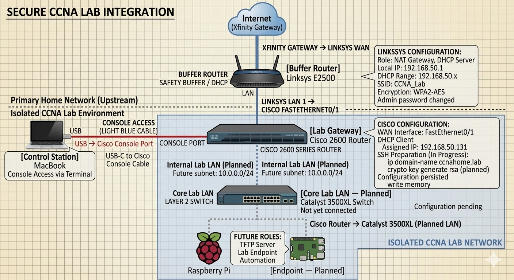

# NetOps CCNA Safety Buffer Lab

Goal: Build an isolated CCNA lab environment that allows internet access while protecting the primary home network.

## High-Level Overview

- Cisco 2600 configured as a lab gateway behind a Linksys E2500 buffer router
- Network isolation implemented to protect the primary home network
- DHCP connectivity established and internet reachability verified
- Router prepared for SSH remote management

## Equipment & Technologies

- Cisco 2600 Router (Lab Gateway)
- Cisco 1700 Router
- Catalyst 3500 XL Switch
- Linksys E2500 Router (Safety Buffer)
- MacBook Terminal (Console Access)
- Raspberry Pi (planned endpoint)

## High-Level Topology

## Key Achievements

- Implemented a safety buffer network to isolate CCNA lab traffic
- Configured DHCP WAN interface on the Cisco router
- Verified connectivity to the gateway and the internet
- Prepared router configuration for SSH remote management

## Next Steps

- Generate RSA keys and enable SSH remote access
- Connect the Catalyst 3500XL switch
- Configure the internal lab LAN
- Integrate Raspberry Pi endpoint

## Full Lab Documentation

Detailed step-by-step documentation is available here:

project-writeups/secure-ccna-lab-integration.md
