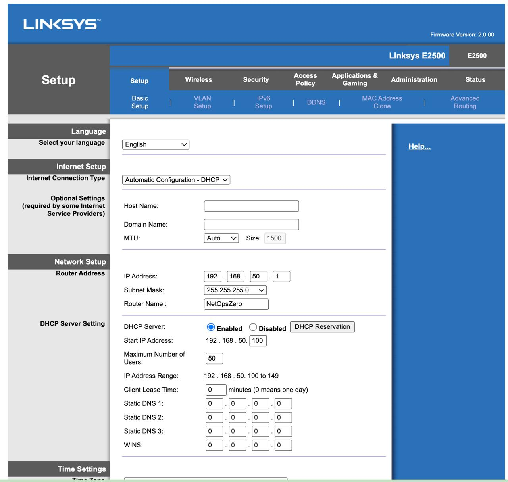
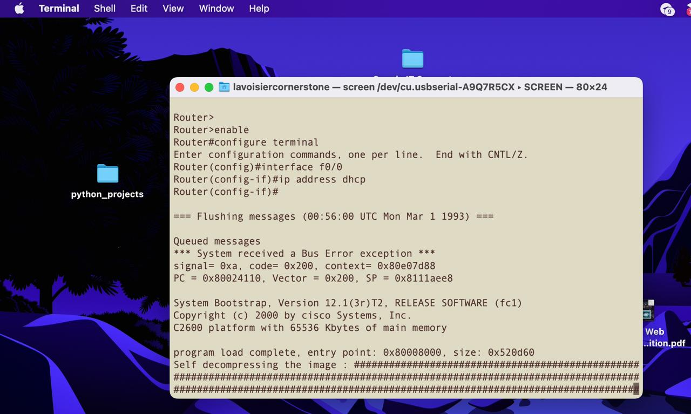

# Secure CCNA Lab Integration — Technical Writeup

**Repo:** [cornerstonian/netops-ccna-homelab](https://github.com/cornerstonian/netops-ccna-homelab)
**Status:** Active — Lab 05 complete, Lab 06 planned
**Last Updated:** April 2026

---

## Lab Goals

| Goal | Status |
|---|---|
| Isolate lab network from primary home network | ✅ Complete |
| Establish internet connectivity for lab environment | ✅ Complete |
| Implement remote management access | ✅ Complete — Telnet (2621), SSH (1700) |
| Build multi-device Cisco lab topology | ✅ Complete |
| Integrate switch and internal LAN | ✅ Complete — Catalyst 3500XL active, VLANs configured |
| Configure inter-VLAN routing | ✅ Complete — router-on-a-stick via 2621 subinterfaces |
| Integrate Raspberry Pi endpoint | 📋 Planned |

---

## Hardware Inventory

| Device | Role | Status |
|---|---|---|
| Linksys E2500 — NetOpsZero | Buffer router — NAT, DHCP, lab isolation | ✅ Active |
| Cisco 2621 — NetOps-R1 | Inter-VLAN router — IOS 12.1(3)T | ✅ Active |
| Cisco 1700 — NetOps-1700 | SSH lab device — advsecurityk9, IOS 12.4(25d) | ✅ Active |
| Catalyst 3500XL — NetOps-SW1 | Core lab switch — IOS 12.0(5)WC3b | ✅ Active |
| MacBook Pro 2015 | Console management / capture station | ✅ Active |
| Raspberry Pi | TFTP server / Linux endpoint / automation | 📋 Planned |
| Insignia USB-A Gigabit Ethernet | MacBook capture interface (en4) | ✅ Active |

---

## Network Topology

### Current Topology (Lab 05+)

```
Internet
   ↓
Xfinity Gateway
   ↓
Linksys E2500 — NetOpsZero — 192.168.50.1
(Buffer Router — NAT + DHCP — isolation boundary)
   ↓
Catalyst 3500XL — NetOps-SW1 — 192.168.50.30
(Core lab switch — 48-port FastEthernet, IOS 12.0(5)WC3b)
   │
   ├── Fa0/1  [VLAN 1]    → Linksys E2500 (uplink)
   ├── Fa0/2  [VLAN 10]   → MacBook Pro (en4) — 192.168.10.50
   ├── Fa0/3  [TRUNK/ISL] → Cisco 2621 — NetOps-R1 (Fa0/0)
   └── Fa0/4  [VLAN 20]   → Cisco 1700 — NetOps-1700 (Fa0)

MacBook Pro — en4 (Insignia USB-A) — console + capture
```

### VLAN Design

| VLAN | Name | Subnet | Purpose |
|---|---|---|---|
| 1 | default | 192.168.50.0/24 | Switch management + E2500 uplink |
| 10 | MANAGEMENT | 192.168.10.0/24 | MacBook capture station |
| 20 | ROUTERS | 192.168.20.0/24 | Cisco 2621 + Cisco 1700 |

### Device Addressing

| Device | Interface | IP | VLAN |
|---|---|---|---|
| MacBook Pro 2015 | en4 | 192.168.10.50 | 10 |
| Linksys E2500 | LAN | 192.168.50.1 | 1 |
| NetOps-SW1 | VLAN1 SVI | 192.168.50.30 | 1 |
| NetOps-R1 | Fa0/0.10 | 192.168.10.1 | Trunk |
| NetOps-R1 | Fa0/0.20 | 192.168.20.1 | Trunk |
| NetOps-1700 | Fa0 | 192.168.20.20 | 20 |

### Initial Topology (Labs 01–04, archived)

```
Internet
   ↓
Xfinity Gateway
   ↓
Linksys E2500 — 192.168.50.1 (NAT + DHCP)
   ↓
   ├── Cisco 2621 — NetOps-R1 — 192.168.50.10 (Fa0/0)
   │   IOS 12.1(3)T — base image, no crypto
   │   Remote access: Telnet (VTY 0-4)
   │
   └── Cisco 1700 — NetOps-1700 — 192.168.50.20 (Fa0)
       IOS 12.4(25d) — advsecurityk9
       Remote access: SSH

MacBook Pro — 192.168.50.147 (en4) — console + capture
```

---

## Physical Connections

| Connection | Detail |
|---|---|
| Xfinity Gateway → Linksys WAN | Upstream internet feed |
| Linksys LAN → 3500XL Fa0/1 | VLAN 1 uplink — 192.168.50.x |
| 3500XL Fa0/2 → MacBook en4 | VLAN 10 — 192.168.10.50 |
| 3500XL Fa0/3 → 2621 Fa0/0 | ISL trunk — carries VLANs 1, 10, 20 |
| 3500XL Fa0/4 → 1700 Fa0 | VLAN 20 — 192.168.20.20 |
| MacBook USB → Console port | USB serial — `/dev/tty.usbserial-A9Q7R5CX` |

> **Console cable note:** One USB serial adapter handles all console access. With the USB hub in place, multiple console cables can be connected simultaneously. Without it, swap the console cable between devices as needed.

---

## Buffer Router Configuration — Linksys E2500

### Purpose

Isolates the Cisco lab from the upstream home network. Lab misconfigurations, routing changes, and experimental configs cannot reach the primary `192.168.1.x` network.

### Network Configuration

| Setting | Value |
|---|---|
| Router Name | NetOpsZero |
| LAN IP | 192.168.50.1 |
| Subnet | 192.168.50.0/24 |
| DHCP Range | 192.168.50.100 — 192.168.50.149 |
| SSID | NetOpsLab |
| Encryption | WPA2 Personal (AES) |
| Admin password | Changed from default |

> Subnet changed from default `192.168.1.x` to avoid overlap with upstream home network.
> WPS disabled. Manual SSID configuration applied.
> Admin password changed under Administration → Management.



---

## Cisco 2621 Configuration — NetOps-R1

### Device Info

| Setting | Value |
|---|---|
| IOS Image | `c2600-d-mz.121-3.T` |
| IOS Version | 12.1(3)T |
| Crypto Support | None — base image |
| Active Interface | FastEthernet0/0 (trunk to 3500XL) |
| Remote Access | Telnet — lab demonstration only |
| Enable Secret | Set |
| Config Register | 0x2102 |
| Flash | 16MB total — 11.4MB available |

### Interface Configuration — Initial Build (Labs 01–03)

Initial config attempted DHCP on Fa0/0 — produced a Bus Error exception and router crash. See [Bus Error Troubleshooting](#bus-error-exception--fa00-dhcp) below.

Corrected config used Fa0/1 with static IP:

```
interface FastEthernet0/1
 ip address 192.168.50.10 255.255.255.0
 no shutdown
```

### Interface Configuration — Lab 05 Router-on-a-Stick

With the 3500XL integrated and ISL trunking configured, the 2621 was reconfigured for router-on-a-stick inter-VLAN routing. The physical IP was removed from Fa0/0 and subinterfaces created per VLAN:

```
interface FastEthernet0/0
 no ip address

interface FastEthernet0/0.1
 encapsulation isl 1

interface FastEthernet0/0.10
 encapsulation isl 10
 ip address 192.168.10.1 255.255.255.0

interface FastEthernet0/0.20
 encapsulation isl 20
 ip address 192.168.20.1 255.255.255.0
```

> **ISL note:** The 3500XL defaults to ISL trunking — not 802.1Q. Subinterfaces must use `encapsulation isl` to match. This is a platform-specific behavior of IOS 12.0(5)WC3b on the 3500XL.

### Verification

```
NetOps-R1#show ip interface brief
Interface              IP-Address     OK? Method Status   Protocol
FastEthernet0/0        unassigned     YES manual up        up
FastEthernet0/0.1      unassigned     YES manual up        up
FastEthernet0/0.10     192.168.10.1   YES manual up        up
FastEthernet0/0.20     192.168.20.1   YES manual up        up

NetOps-R1#show ip route
C    192.168.10.0/24 is directly connected, FastEthernet0/0.10
C    192.168.20.0/24 is directly connected, FastEthernet0/0.20
```

### VTY Configuration

```
line vty 0 4
 password cisco
 login
 transport input telnet
```

> Telnet is configured on the 2621 for lab demonstration purposes only — used in Lab 03 to prove cleartext credential exposure in Wireshark.

---

## Cisco 1700 Configuration — NetOps-1700

### Device Info

| Setting | Value |
|---|---|
| Hostname | NetOps-1700 |
| IOS Image | `c1700-advsecurityk9-mz.124-25d.bin` |
| IOS Version | 12.4(25d) |
| Crypto Support | Full — advsecurityk9 |
| Interface | FastEthernet0 |
| IP Address | 192.168.20.20 / 255.255.255.0 |
| Default Gateway | 192.168.20.1 (NetOps-R1 Fa0/0.20) |
| SSH Version | 2.0 |
| Flash | 16MB — 2.7MB available |

### Interface Configuration

```
interface FastEthernet0
 ip address 192.168.20.20 255.255.255.0
 no shutdown
```

> Initial IP was `192.168.50.20` from the flat topology. Updated to `192.168.20.20` when the device moved to VLAN 20 in Lab 05.

### SSH Configuration (Lab 04 — Complete)

```
ip domain-name ccnahome.lab
username admin privilege 15 secret cisco123
crypto key generate rsa
! Key size: 1024 bits
ip ssh version 2
line vty 0 4
 transport input ssh
 login local
exit
write memory
```

### Routing

```
ip route 0.0.0.0 0.0.0.0 192.168.20.1
```

Default route added in Lab 05 — required for the 1700 to return traffic to VLAN 10 hosts via the 2621.

### macOS SSH Access

Modern macOS OpenSSH dropped support for legacy key exchange algorithms required by IOS 12.4. A `~/.ssh/config` entry is required for clean access:

```
Host 192.168.50.20
  HostName 192.168.50.20
  User admin
  KexAlgorithms +diffie-hellman-group1-sha1
  HostKeyAlgorithms +ssh-rsa
  Ciphers +aes128-cbc
```

After this configuration, `ssh 192.168.50.20` connects without flags. Console cable is reserved for ROMMON recovery and Layer 1 failures only.

---

## Catalyst 3500XL Configuration — NetOps-SW1

### Device Info

| Setting | Value |
|---|---|
| Model | Cisco WS-C3548-XL |
| Hostname | NetOps-SW1 |
| IOS Image | `c3500XL-c3h2s-mz.120-5.WC3b.bin` |
| IOS Version | 12.0(5)WC3b |
| Ports | 48 x FastEthernet + 2 x GigabitEthernet |
| Trunking | ISL (default) — 802.1Q not supported on this IOS |
| STP | Classic 802.1D |
| Management IP | 192.168.50.30 (VLAN1 SVI) |
| Default Gateway | 192.168.50.1 |

### IOS Behavioral Notes

Two behaviors differ from modern Catalyst IOS that affect configuration procedure:

1. **VLAN creation requires `vlan database` mode** — the `vlan <id>` command in global config mode produces `% Invalid input detected`. Use `vlan database` → `vlan 10 name MANAGEMENT` → `apply` → `exit`.
2. **VLAN port assignments are not stored in running-config** — they live in `flash:vlan.dat`. `show running-config` will show empty interface stanzas even when assignments are active. `show vlan brief` is the authoritative verification command.

### Baseline Configuration

```
enable
conf t
hostname NetOps-SW1
enable secret cisco123
interface vlan 1
 ip address 192.168.50.30 255.255.255.0
 no shutdown
exit
ip default-gateway 192.168.50.1
end
write memory
```

### VLAN Creation

```
vlan database
vlan 10 name MANAGEMENT
vlan 20 name ROUTERS
apply
exit
```

### Port Assignment

```
conf t
interface fastethernet0/2
 switchport access vlan 10
interface fastethernet0/3
 switchport mode trunk
interface fastethernet0/4
 switchport access vlan 20
end
```

### Trunk Verification

```
NetOps-SW1#show interfaces fastethernet0/3 switchport
Administrative mode: trunk
Operational Mode: trunk
Administrative Trunking Encapsulation: isl
Operational Trunking Encapsulation: isl
Trunking VLANs Active: 1,10,20
```

### VLAN Verification

```
NetOps-SW1#show vlan brief
VLAN Name          Status    Ports
1    default        active    Fa0/1, Fa0/5–Fa0/48, Gi0/1, Gi0/2
10   MANAGEMENT     active    Fa0/2
20   ROUTERS        active    Fa0/3, Fa0/4
```

---

## Troubleshooting

### Bus Error Exception — Fa0/0 DHCP

During initial configuration, `ip address dhcp` was applied to Fa0/0 instead of Fa0/1. The router threw a Bus Error exception and crashed immediately.

```
*** System received a Bus Error exception ***
signal= 0xa, code= 0x200, context= 0x80e07d88
PC = 0x80024110, Vector = 0x200, SP = 0x8111aee8
```



Root cause: Fa0/0 had no physical cable — the Bus Error was triggered by the interface attempting DHCP negotiation with no physical link. Config was rebuilt on Fa0/1 where the cable was connected.

---

### Interface Fa0/0 vs Fa0/1 — IP Assignment

After ROMMON recovery, ping to `192.168.50.10` failed with `No route to host`.

```
NetOps-R1#show ip interface brief
Interface         IP-Address      OK? Method Status    Protocol
FastEthernet0/0   192.168.50.10   YES NVRAM  up        down
FastEthernet0/1   unassigned      YES NVRAM  admin down down
```

`up/down` on Fa0/0 = no physical link. Cable was on Fa0/1.

**Resolution:**

```
interface fastethernet0/0
 no ip address
 shutdown
exit
interface fastethernet0/1
 ip address 192.168.50.10 255.255.255.0
 no shutdown
```

---

### macOS Service Order — Dual Interface Conflict

When the MacBook was connected to the 3500XL (VLAN 10) while on Wi-Fi, macOS routed internet traffic through en4 — losing the gateway and dropping internet connectivity. Root cause: USB Ethernet adapters were listed above Wi-Fi in the macOS network service order.

**Fix — set Wi-Fi as primary interface:**

```bash
sudo networksetup -ordernetworkservices "Wi-Fi" "USB 10/100/1G/2.5G LAN" "USB 10/100/1000 LAN" "Thunderbolt Bridge"
```

After this fix, en0 (Wi-Fi) handles internet and en4 handles lab traffic simultaneously without conflict.

---

### VLAN Port Assignments Not Persisting

On the 3500XL, VLAN port assignments appeared to disappear after switch disturbance. Root cause: assignments are stored in `flash:vlan.dat`, not running-config. `show running-config` showed empty interface stanzas. `show vlan brief` confirmed assignments were active.

**Verification command:** Always use `show vlan brief` — not `show running-config` — to confirm port assignments on XL-era IOS.

---

### 1700 Inter-VLAN Return Route Missing

After configuring router-on-a-stick, ping from MacBook (VLAN 10, `192.168.10.50`) to the 1700 (VLAN 20, `192.168.20.20`) succeeded in one direction only. The 2621 could ping the 1700, but the MacBook could not.

Root cause: The 1700 had no route back to `192.168.10.0/24`. Reply packets were dropped silently.

```
Netops-1700#show ip route
Gateway of last resort is not set
C    192.168.20.0/24 is directly connected, FastEthernet0
```

**Resolution:** Added default route on the 1700:

```
ip route 0.0.0.0 0.0.0.0 192.168.20.1
```

Result: `Gateway of last resort is 192.168.20.1 to network 0.0.0.0` — full bidirectional routing confirmed.

---

## ROMMON Password Recovery

The original startup-config on the 2621 contained an unknown `enable secret` hash. Standard privileged exec access was blocked.

### Symptom

```
Router>enable
Password:
Password:
Password:
% Bad secrets
```

### Root Cause

`enable secret` (MD5 hash) present in startup-config from previous owner. Hash unknown — cannot be reversed. `enable secret` overrides `enable password` regardless of what is set in running-config.

### Recovery Procedure

**Step 1 — Send break signal during boot**

In `screen` on macOS, within 60 seconds of power-on:
```
Ctrl+A then \
```

**Step 2 — Set config register to bypass NVRAM**

```
rommon 1 > confreg 0x2142
rommon 2 > reset
```

`0x2142` instructs the router to ignore startup-config on boot. Router comes up with blank running-config — no passwords enforced.

**Step 3 — Enter privileged exec**

```
Router>enable
Router#
```

No password required — running-config is empty.

**Step 4 — Erase startup-config**

> **Critical:** Do not run `copy startup-config running-config`. This reloads the unknown `enable secret` hash back into RAM, blocking access again.

```
Router#erase startup-config
```

**Step 5 — Build config from scratch**

```
Router#conf t
Router(config)#hostname NetOps-R1
NetOps-R1(config)#enable secret cisco123
NetOps-R1(config)#line vty 0 4
NetOps-R1(config-line)#password cisco
NetOps-R1(config-line)#login
NetOps-R1(config-line)#transport input telnet
NetOps-R1(config-line)#exit
NetOps-R1(config)#interface fastethernet0/1
NetOps-R1(config-if)#ip address 192.168.50.10 255.255.255.0
NetOps-R1(config-if)#no shutdown
NetOps-R1(config-if)#exit
NetOps-R1(config)#config-register 0x2102
NetOps-R1(config)#exit
NetOps-R1#write memory
NetOps-R1#reload
```

**Step 6 — Verify after reload**

```
show version
# Configuration register is 0x2102 — confirms normal boot restored

show ip interface brief
# FastEthernet0/1 — 192.168.50.10 — up — up
```

---

## IOS Upgrade — Decision Log

### Original Plan

Upgrade 2621 from `c2600-d-mz` (base, no crypto) to `c2600-adventerprisek9-mz` (crypto-capable) via TFTP to enable SSH.

### Flash Analysis

```
NetOps-R1#show flash
[5377816 bytes used, 11399400 available, 16777216 total]
```

| Item | Size |
|---|---|
| Current image (`c2600-d-mz`) | ~5.4MB |
| Available flash | ~11.4MB |
| Required k9 image | ~13–16MB |

Available flash insufficient to hold both images simultaneously. Upgrade requires delete-first procedure — if TFTP transfer fails mid-stream, router has no bootable image and requires ROMMON recovery with TFTP boot. Upgrade deferred. Cisco 1700 selected as dedicated SSH lab device instead.

**Outcome:** The 1700 running `advsecurityk9` IOS 12.4(25d) is a better SSH lab device than an upgraded 2621 would have been — SSH v2, RSA 1024-bit keys, dedicated device, and the cleartext vs encrypted contrast between Telnet on the 2621 and SSH on the 1700 is a stronger lab outcome than SSH on a single device.

---

## Console Access — Technical Notes

| Item | Detail |
|---|---|
| USB serial adapter | Insignia USB-A — `/dev/tty.usbserial-A9Q7R5CX` |
| Terminal command | `screen /dev/tty.usbserial-A9Q7R5CX 9600` |
| Break signal (macOS screen) | `Ctrl+A` then `\` |
| Ghost session check | `screen -list` |
| Kill ghost session | `screen -X -S [session name] quit` |
| Kill all screen sessions | `killall screen` |
| 3500XL console port | RJ-45 console — left side of front panel |
| 2621 console port | RJ-45 console — rear panel |
| 1700 console port | Labeled CON — not Ethernet or AUX |

> If `screen` terminates immediately on connect, run `killall screen` to clear all sessions before opening a new one.

> **SSH replaces console for 1700:** After Lab 04, `ssh 192.168.50.20` (now `192.168.20.20` post-Lab 05) is the primary access method for NetOps-1700. Console cable is reserved for ROMMON recovery and Layer 1 failures only.

---

## Next Steps

- Lab 06 — Access Control Lists on 2621 between VLANs — RST and ICMP Admin Prohibited capture
- Labs 07–11 — DNS, ICMP, TCP, UDP, Statistics — Wireshark analysis series
- Lab 12 — Capstone troubleshooting scenario — 4 injected faults, Wireshark-only diagnosis
- Acquire Raspberry Pi — TFTP server and Linux endpoint
- Build Golden Config Auditor — Netmiko automation project against homelab devices
- CCNA exam — May 2026

---

*Lavoisier Cornerstone — [lavoisier.dev](https://lavoisier.dev) | [github.com/cornerstonian](https://github.com/cornerstonian)*
